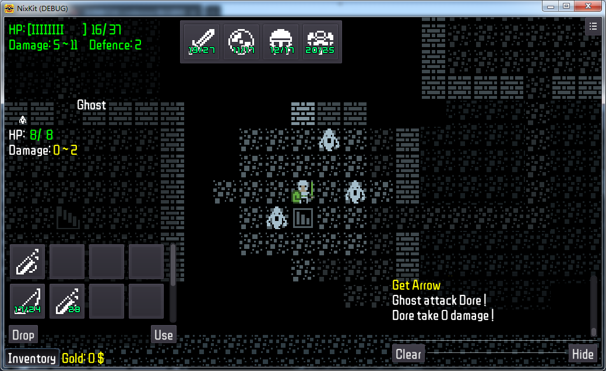

#  Welcome to Simple Dungeon !!!


 A Simple Roguelike Game
===

* simple control
* simple mechanism
* simple graphic
* simple SFX
* simple fun

# Preview

Simple Dungeon is a light weight roguelike game made by Godot game engine

## Download

## News
> 2021.04.04
> Prototype Complete

```markdown
Syntax highlighted code block

# Header 1
## Header 2
### Header 3

- Bulleted
- List

1. Numbered
2. List

**Bold** and _Italic_ and `Code` text

[Link](url) and 
```

For more details see [GitHub Flavored Markdown](https://guides.github.com/features/mastering-markdown/).

### Jekyll Themes

Your Pages site will use the layout and styles from the Jekyll theme you have selected in your [repository settings](https://github.com/MinicSimpleDungeon/simpledungeon.github.io/settings). The name of this theme is saved in the Jekyll `_config.yml` configuration file.

### Support or Contact

Having trouble with Pages? Check out our [documentation](https://docs.github.com/categories/github-pages-basics/) or [contact support](https://support.github.com/contact) and we’ll help you sort it out.
